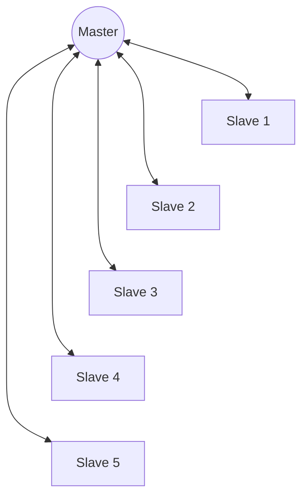

# Topologies

## Hub and Spoke

 

```mermaid
flowchart TD
    %% Master
    Hub((Master))

    %% Spoke Nodes
    Spoke1[Slave 1]
    Spoke2[Slave 2]
    Spoke3[Slave 3]
    Spoke4[Slave 4]
    Spoke5[Slave 5]

    %% Hub to Spoke Connections
    Hub <--> Spoke1
    Hub <--> Spoke2
    Hub <--> Spoke3
    Hub <--> Spoke4
    Hub <--> Spoke5

    %% Invisible links to force a circular/symmetric layout
    Spoke1 ~~~ Spoke2 ~~~ Spoke3 ~~~ Spoke4 ~~~ Spoke5 ~~~ Spoke1
```

 

## Point To Point

 

	</img>

 